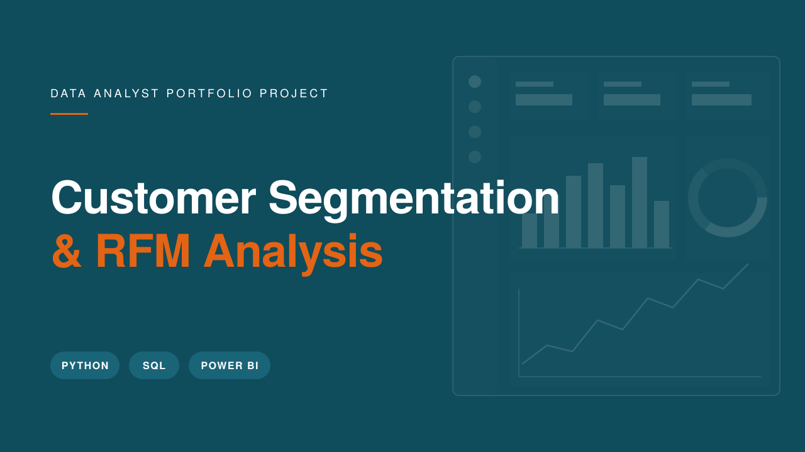

<div align="center">



# 🛍️ Customer Segmentation & RFM Analysis

### Identifying £41M in Revenue at Risk Across 5,878 Customers

[](https://www.python.org/)
[](https://www.mysql.com/)
[](https://powerbi.microsoft.com/)
[](https://pandas.pydata.org/)

[](https://youtu.be/iQg2gUlZbgg)
[](https://www.linkedin.com/in/ahmed-al-rafsan/)

</div>

---

## 📋 Table of Contents

- [Executive Summary](#-executive-summary)
- [Business Problem](#-business-problem)
- [Dataset](#-dataset)
- [Tools & Technologies](#-tools--technologies)
- [Methodology](#-methodology)
- [Key Findings](#-key-findings)
- [Dashboard Preview](#-dashboard-preview)
- [Business Recommendations](#-business-recommendations)
- [Project Structure](#-project-structure)
- [How to Run Locally](#-how-to-run-locally)
- [Video Walkthrough](#-video-walkthrough)
- [About the Author](#-about-the-author)

---

## 🎯 Executive Summary

An end-to-end customer analytics project analysing **over 1 million transactions** from a UK-based online retailer to answer one critical question:

> *Which customers drive the business, and which are quietly walking away?*

Using **RFM scoring**, **cohort retention analysis**, and **Customer Lifetime Value (CLV)** modelling, this project segments 5,878 unique customers into actionable groups — uncovering **£41.36M in revenue at risk** from customers showing early churn signals, and identifying a critical **75–80% first-month churn gap** that points directly at an onboarding problem.

The analysis moves from raw CSV → Python cleaning → SQL querying → Power BI storytelling, delivering findings the way a Data Analyst presents to stakeholders in a business meeting — not just a code tutorial.

---

## 💼 Business Problem

A UK-based online retailer treats every customer the same. The same promotions, the same emails, the same discounts — regardless of whether a customer is a loyal high-spender or someone who bought once two years ago and never came back.

**This is expensive.** It wastes marketing budget on customers who will never return, and fails to protect the top 25% who generate the majority of revenue.

**The goal of this project:**
1. Identify which customers are most valuable (and why)
2. Quantify the revenue at risk from churning customers
3. Uncover retention patterns that point to actionable business fixes
4. Build a decision-ready dashboard for marketing and leadership teams

---

## 📊 Dataset

| Attribute | Detail |
|---|---|
| **Source** | [Online Retail II — UCI Machine Learning Repository](https://archive.ics.uci.edu/dataset/502/online+retail+ii) |
| **Records** | 1,067,371 transactions (raw) → 805,549 after cleaning |
| **Period** | December 2009 – December 2011 |
| **Context** | Real transactional data from a UK-based online gift retailer |
| **Unique Customers** | 5,878 |
| **Countries** | 40+ |
| **License** | CC BY 4.0 |

### Column Schema

| Column | Description |
|---|---|
| `Invoice` | Invoice number (prefix 'C' indicates cancellation) |
| `StockCode` | Unique product identifier |
| `Description` | Product name |
| `Quantity` | Units purchased per transaction |
| `InvoiceDate` | Timestamp of transaction |
| `Price` | Unit price in GBP (£) |
| `Customer ID` | Unique customer identifier |
| `Country` | Customer's country of residence |

---

## 🛠️ Tools & Technologies

<table>
<tr>
<td><b>Category</b></td>
<td><b>Stack</b></td>
</tr>
<tr>
<td>Data Cleaning & Analysis</td>
<td>Python (pandas, NumPy)</td>
</tr>
<tr>
<td>Visualisation (Python)</td>
<td>Matplotlib, Seaborn</td>
</tr>
<tr>
<td>Database</td>
<td>MySQL (via MySQL Workbench)</td>
</tr>
<tr>
<td>Dashboarding</td>
<td>Power BI Desktop</td>
</tr>
<tr>
<td>Data Modelling</td>
<td>DAX, Power Query</td>
</tr>
<tr>
<td>Environment</td>
<td>VS Code, Python 3.12</td>
</tr>
</table>

---

## 🔬 Methodology

The project follows a structured, repeatable workflow that mirrors how a Data Analyst tackles a real business problem.

### 1️⃣ Data Cleaning & Preparation
- Removed 1,067,371 → 805,549 rows through systematic filtering
- Dropped missing `Customer ID` (~25% of rows, unusable for customer analysis)
- Removed cancellations (invoices starting with 'C')
- Filtered out negative quantities and zero/negative prices
- Converted `InvoiceDate` to proper datetime format
- Created a `Total_Price` column (Quantity × Price)

### 2️⃣ Exploratory Data Analysis
- Calculated total revenue, unique customers, and transaction volumes
- Identified top-performing countries by revenue
- Analysed monthly revenue trends to detect seasonality
- Surfaced top-selling products (with and without noise items like "POSTAGE")

### 3️⃣ RFM Scoring
Built a classical RFM model to score every customer on three dimensions:
- **Recency** — days since last purchase
- **Frequency** — number of separate orders placed
- **Monetary** — total spend

Used quintile-based scoring (1–5) and assigned each customer to one of seven behavioural segments: *Champion, Loyal Customer, Can't Lose Them, Promising, New Customer, Need Attention, Lost*.

### 4️⃣ Cohort Retention Analysis
- Grouped customers by their first-purchase month (cohort)
- Tracked what percentage of each cohort returned in subsequent months
- Visualised the retention decay pattern across 25 months of data

### 5️⃣ Customer Lifetime Value (CLV)
- Calculated `CLV = Average Order Value × Purchase Frequency × Customer Lifespan`
- Measured real lifespan in months from first to last purchase
- Compared CLV across segments to quantify business impact

### 6️⃣ SQL Business Queries
Loaded cleaned data into MySQL and wrote 8 business queries covering:
- Top customers and countries
- Monthly revenue trends
- Product performance
- RFM analysis using CTEs and DATEDIFF
- Customer segmentation via CASE WHEN logic
- Segment summary with percentages

### 7️⃣ Power BI Dashboard
Built a 3-page executive dashboard telling the story from overview to deep-dive to retention analysis.

---

## 📈 Key Findings

> These are the numbers that matter. Each one represents a business decision waiting to happen.

### 💰 Revenue Concentration
- **£17.74M** total revenue across 2 years
- **1,482 Champions (25% of customers) drive 69.3% of total revenue**
- **Top 4 international markets** (EIRE, Netherlands, Germany, France) generate £1.96M combined

### ⚠️ Revenue at Risk
- **£41.36M** in lifetime value at risk from 780 "Can't Lose Them" customers showing churn signals
- **1,523 customers (26%)** have already been lost — they haven't returned in months
- Without intervention, these customers represent permanent lost revenue

### 📊 The 177x Value Gap
- Champions have an average CLV of **£177,000**
- Lost customers have an average CLV of just **£1,000**
- This means **one Champion is worth 177 Lost customers** — yet marketing treats them identically

### 📉 The Onboarding Gap
- **75–80% of new customers churn within the first month**
- This isn't a "bad customer" problem — it's an **onboarding problem**
- Fixing the first-month experience is the single highest-leverage change the business can make

### 🎄 Seasonal Pattern
- Strong revenue spike every **November**, driven by Christmas shopping
- November 2011 alone generated £1.16M — the peak month in the dataset
- Retention jumps across nearly all cohorts during November, suggesting seasonal re-engagement

---

## 📊 Dashboard Preview

The Power BI dashboard is structured as a **three-page executive narrative** — moving from high-level business overview, into customer segmentation strategy, and finally into retention diagnostics.

### Page 1 — Executive Overview
*The business at a glance: revenue, customers, seasonality, and international markets.*


### Page 2 — Customer Segmentation Deep Dive
*Who are our best customers? Who's at risk? Where's the value concentrated?*


### Page 3 — Cohort Retention Analysis
*Why are customers leaving, and when?*


---

## 💡 Business Recommendations

Based on the analysis, here are four concrete actions the business should take — ranked by expected impact.

| Priority | Segment | Recommended Action | Expected Impact |
|---|---|---|---|
| 🔴 **Critical** | Can't Lose Them (780 customers) | Immediate win-back campaign with personalised offers and re-engagement emails | Recover portion of **£41.36M** at-risk lifetime value |
| 🟠 **High** | Champions (1,482 customers) | Launch VIP loyalty programme — early access, exclusive perks, referral rewards | Protect **69.3% of revenue**; increase advocacy |
| 🟡 **Medium** | New Customers (first 30 days) | Fix the onboarding experience — welcome series, tutorials, first-repeat discount | Reduce **75–80% month-1 churn** |
| 🟢 **Long-term** | Lost Customers (1,523) | Low-cost survey + dormant-reactivation discount | Reactivate portion of **£1.52M** lost revenue |

### Why this matters
Treating all 5,878 customers identically is leaving millions on the table. Segmented marketing isn't a "nice to have" — it's the difference between losing £41M and protecting it.

---

## 📁 Project Structure

```
Customer-Segmentation-RFM-Analysis/
│
├── README.md                          ← You are here
├── requirements.txt                   ← Python dependencies
│
├── python/                            ← Data pipeline scripts
│   ├── 01_analysing_data_before_cleaning.py
│   ├── 02_data_cleaning.py
│   ├── 03_eda.py
│   ├── 04_rfm_scoring.py
│   ├── 05_cohort_analysis.py
│   ├── 06_clv_calculation.py
│   └── 07_load_to_mysql.py
│
├── sql/                               ← MySQL business queries
│   ├── 01_basic_exploration.sql
│   ├── 02_top_customers.sql
│   ├── 03_revenue_by_country.sql
│   ├── 04_monthly_revenue_trend.sql
│   ├── 05_top_products.sql
│   ├── 05b_top_products_filtered.sql
│   ├── 06_rfm_analysis.sql
│   ├── 07_customer_segmentation.sql
│   └── 08_segment_summary.sql
│
├── power_bi/                          ← Dashboard files
│   ├── P3_Customer_Segmentation.pbix
│   └── screenshots/
│       ├── 1_Executive_Overview.png
│       ├── 2_Customer_Segmentation.png
│       └── 3_Cohort_Retention_Analysis.png
│
└── visuals/                           ← Python-generated charts & thumbnail
    ├── thumbnail.png
    ├── 04_Monthly_Revenue.png
    ├── 05_Top_10_Countries_by_Revenue_Excluding_UK.png
    └── 06_Cohort_Retention_Heatmap.png
```

---

## 🚀 How to Run Locally

### Prerequisites
- Python 3.10+
- MySQL Server (for SQL queries)
- Power BI Desktop (for viewing the dashboard)

### Setup

**1. Clone the repository**
```bash
git clone https://github.com/Ahmed-Al-Rafsan/Customer-Segmentation-RFM-Analysis.git
cd Customer-Segmentation-RFM-Analysis
```

**2. Install dependencies**
```bash
pip install -r requirements.txt
```

**3. Download the dataset**
Get the [Online Retail II dataset](https://archive.ics.uci.edu/dataset/502/online+retail+ii) and place `online_retail_II.csv` inside a `data/` folder.

> **Note:** You'll need to update the file paths at the top of each Python script to match your local environment.

**4. Run the Python pipeline in order**
```bash
python python/01_analysing_data_before_cleaning.py
python python/02_data_cleaning.py
python python/03_eda.py
python python/04_rfm_scoring.py
python python/05_cohort_analysis.py
python python/06_clv_calculation.py
```

**5. Load data into MySQL (optional)**
```bash
python python/07_load_to_mysql.py
```
Then run the SQL queries in `sql/` via MySQL Workbench.

**6. Open the Power BI dashboard**
Open `power_bi/P3_Customer_Segmentation.pbix` in Power BI Desktop.

---

## 🎥 Video Walkthrough

For a full presentation of the project — walking through the business problem, the analysis, and the findings the way I'd present them in a stakeholder meeting — watch the video walkthrough:

[](https://youtu.be/iQg2gUlZbgg)

**Duration:** 10:30 minutes
**Format:** Dashboard walkthrough + business insights presentation

---

## 👤 About the Author

<div align="left">

### **Rafsan Ahmed Al**
**Data Analyst | Python · SQL · Power BI · Tableau**

📍 Based in Melbourne, Australia
🎓 Master's in Business Analytics
💼 Turning raw data into business decisions

[](https://github.com/Ahmed-Al-Rafsan)
[](https://www.linkedin.com/in/ahmed-al-rafsan/)
[](https://www.youtube.com/@AhmedAlRafsan)
[](mailto:ahmed.rafsan108@gmail.com)

</div>

> *"Data analysis is not about making charts. It's about finding the story behind the numbers and turning it into actionable business recommendations."*

---

## 📄 Citation

Chen, D. (2012). *Online Retail II* [Dataset]. UCI Machine Learning Repository. https://doi.org/10.24432/C5CG6D

---

<div align="center">

### ⭐ If you found this project useful, please consider giving it a star!

**Part of my Data Analyst Portfolio Series** — [View All Projects →](https://github.com/Ahmed-Al-Rafsan)

</div>
